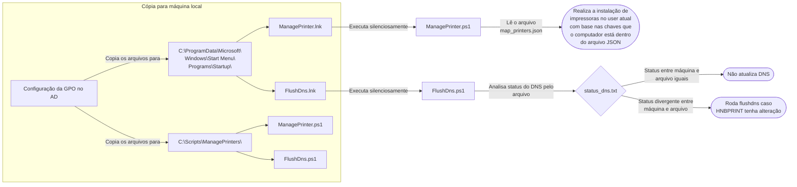
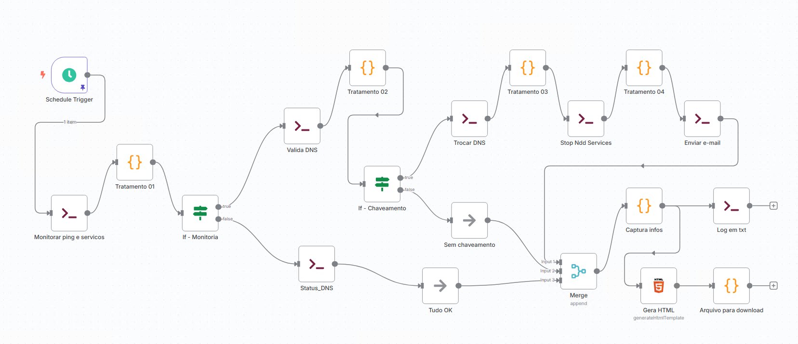

# Sistema de Instalação Automática de Impressoras via GPO

## 📋 Descrição

Sistema automatizado para instalação de filas de impressão nas máquinas do domínio, utilizando GPO (Group Policy Objects) para distribuição de scripts e execução no logon do usuário.

---

## 📑 Tarefas

| Tarefa | Detalhamento |
|--------|--------------|
| **Cópia de arquivos por GPO** | Copia os arquivos `\\nipo.local\NETLOGON\Connect_Printers\FlushDns.ps1` e `\\nipo.local\NETLOGON\Connect_Printers\ManagePrinter.ps1` para `C:\Scripts\ManagePrinters\`<br><br>Copia os arquivos `\\nipo.local\NETLOGON\Connect_Printers\FlushDns.lnk` e `\\nipo.local\NETLOGON\Connect_Printers\ManagePrinter.lnk` para `C:\ProgramData\Microsoft\Windows\Start Menu\Programs\Startup`<br><br>⚠️ GPO está sendo executada por máquina, necessário mover o computador para a OU correta onde a GPO esteja ativa |
| **map_printers.json** | Arquivo localizado em `\\nipo.local\NETLOGON\Connect_Printers`. Contém os nomes das filas e as máquinas atribuídas a cada fila. Serve para que o script `ManagePrinter.ps1` possa fazer as instalações das filas corretas. |
| **ManagePrinter.lnk** | Chama o arquivo `\\nipo.local\NETLOGON\Connect_Printers\ManagePrinter.ps1` de forma silenciosa no logon do usuário |
| **FlushDns.lnk** | Chama o arquivo `\\nipo.local\NETLOGON\Connect_Printers\FlushDns.ps1` de forma silenciosa no logon do usuário |
| **ManagePrinter.ps1** | Coleta o nome da máquina e procura no arquivo `\\nipo.local\NETLOGON\Connect_Printers\map_printers.json`. Após isso, realiza a instalação da impressora conforme a chave vinculada (ex.: computador `HTICNB006006` está na chave `"HNB"`). Também remove qualquer impressora que aponta para `10.10.203.131`.<br><br>Gera arquivo `C:\Scripts\ManagePrinters\printserver_rollback.txt` |
| **FlushDns.ps1** | Executa o flushdns na máquina caso o host do HNBPRINT esteja diferente do status atual |
| **status_dns.txt** | Localizado em `\\Hnpsrvfsv01\ndd\status_dns.txt`. Contém o status do DNS atual para HNBPRINT |
| **printserver_rollback.txt** | Gerado em `C:\Scripts\ManagePrinters\printserver_rollback.txt` caso haja necessidade de instalar as impressoras do servidor `10.10.203.131` novamente |
| **Rollback_pr.ps1** | Localizado em `\\nipo.local\NETLOGON\connect_Printers\Rollback_pr.ps1`. Coloque em uma GPO de reversão para executar nas máquinas, caso seja necessário fazer rollback. Criar atalho da mesma forma que foi criado para os arquivos de instalação e repetir mesma configuração da GPO |

---

## 🔄 Mapeamento Lógico



---

## 📂 Arquivos de Atalho

- `Rollback_pr.lnk`
- `FlushDns.lnk`
- `ManagePrinter.lnk`

## 📜 Arquivos de Script

- `Rollback_pr.ps1`
- `FlushDns.ps1`
- `ManagePrinter.ps1`

---

## 🔗 Fluxo n8n

**HNBPRINT**



---

## 🛠️ Criação de Atalhos

```powershell
# Cria atalho para ManagePrinter
$WshShell = New-Object -ComObject WScript.Shell
$shortcut = $WshShell.CreateShortcut("C:\ProgramData\Microsoft\Windows\Start Menu\Programs\Startup\ManagePrinter.lnk")

$shortcut.TargetPath = "powershell.exe"
$shortcut.Arguments = '-WindowStyle Hidden -ExecutionPolicy Bypass -NoProfile -NonInteractive -File "C:\Scripts\ManagePrinters\ManagePrinter.ps1"'
$shortcut.WindowStyle = 7  # Minimizado (invisível)
$shortcut.WorkingDirectory = "C:\Scripts\ManagePrinters"
$shortcut.Description = "Sistema de Impressoras Automático"
$shortcut.IconLocation = "shell32.dll,21"  # Ícone de impressora
$shortcut.Save()

# Cria atalho para FlushDns
$WshShell = New-Object -ComObject WScript.Shell
$shortcut = $WshShell.CreateShortcut("C:\ProgramData\Microsoft\Windows\Start Menu\Programs\Startup\FlushDns.lnk")

$shortcut.TargetPath = "powershell.exe"
$shortcut.Arguments = '-WindowStyle Hidden -ExecutionPolicy Bypass -NoProfile -NonInteractive -File "C:\Scripts\ManagePrinters\FlushDns.ps1"'
$shortcut.WindowStyle = 7  # Minimizado (invisível)
$shortcut.WorkingDirectory = "C:\Scripts\ManagePrinters"
$shortcut.Description = "Sistema Flush DNS"
$shortcut.IconLocation = "shell32.dll,21"  # Ícone de impressora
$shortcut.Save()

# Cria atalho para Rollback_pr
$WshShell = New-Object -ComObject WScript.Shell
$shortcut = $WshShell.CreateShortcut("C:\ProgramData\Microsoft\Windows\Start Menu\Programs\Startup\Rollback_pr.lnk")

$shortcut.TargetPath = "powershell.exe"
$shortcut.Arguments = '-WindowStyle Hidden -ExecutionPolicy Bypass -NoProfile -NonInteractive -File "C:\Scripts\ManagePrinters\Rollback_pr.ps1"'
$shortcut.WindowStyle = 7  # Minimizado (invisível)
$shortcut.WorkingDirectory = "C:\Scripts\ManagePrinters"
$shortcut.Description = "Sistema Rollback_pr"
$shortcut.IconLocation = "shell32.dll,21"  # Ícone de impressora
$shortcut.Save()
```

---

## ✅ Validação das Tarefas

```powershell
Get-Process | ForEach-Object {
    try {
        $cmdLine = (Get-CimInstance -ClassName Win32_Process -Filter "ProcessId = $($_.Id)").CommandLine
        if ($cmdLine -and $cmdLine -match "FlushDns|ManagePrinter|Rollback_pr\.(bat|vbs|ps1)") {
            [PSCustomObject]@{
                PID = $_.Id
                ProcessName = $_.ProcessName
                CommandLine = $cmdLine
            }
        }
    } catch { }
} | Format-Table -AutoSize -Wrap

# Versões mais leves e rápidas
Get-WmiObject -Class Win32_Process | Where-Object { $_.CommandLine -match "FlushDns|ManagePrinter|Rollback_pr\.(bat|vbs|ps1)" } | Select-Object ProcessId, Name, CommandLine | Format-Table -AutoSize -Wrap

Get-WmiObject -Query "SELECT ProcessId, Name, CommandLine FROM Win32_Process WHERE CommandLine LIKE '%FlushDns%' OR CommandLine LIKE '%ManagePrinter%' OR CommandLine LIKE '%Rollback_pr%'" | Select-Object ProcessId, Name, CommandLine | Format-Table -AutoSize -Wrap

# Computador remoto
$nomePC
Get-WmiObject -Class Win32_Process -ComputerName "$nomePC" -Filter "Name = 'cmd.exe' OR Name = 'powershell.exe'" | Where-Object { $_.CommandLine -match "FlushDns|ManagePrinter|Rollback_pr" } | Select-Object ProcessId, Name, CommandLine
```

---

## 📌 Observações

- A GPO é executada **por máquina**, portanto o computador precisa estar na OU correta.
- Os scripts são executados de forma **silenciosa** no logon do usuário.
- O arquivo `printserver_rollback.txt` é gerado apenas quando necessário.
- O `Rollback_pr.ps1` deve ser usado em uma **GPO de reversão** separada.